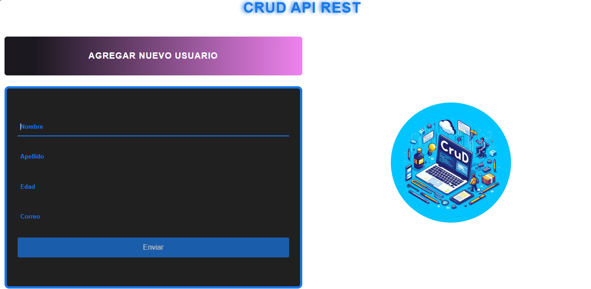
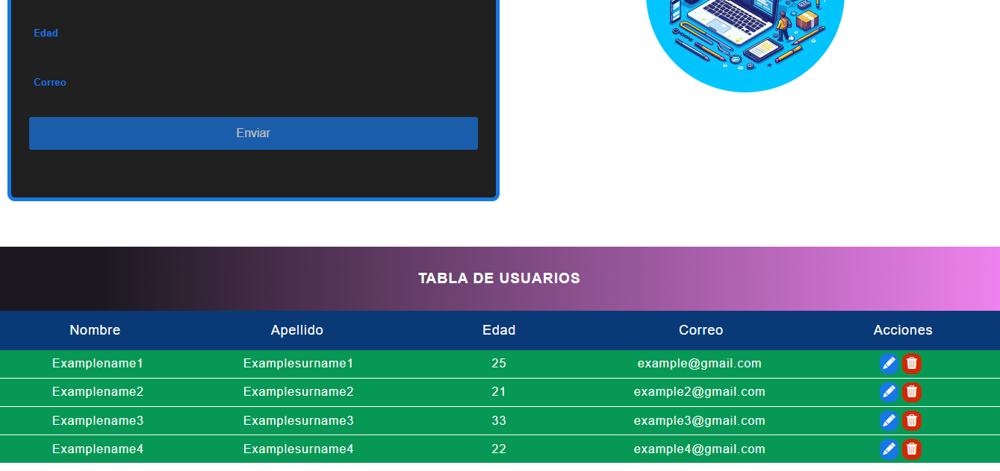
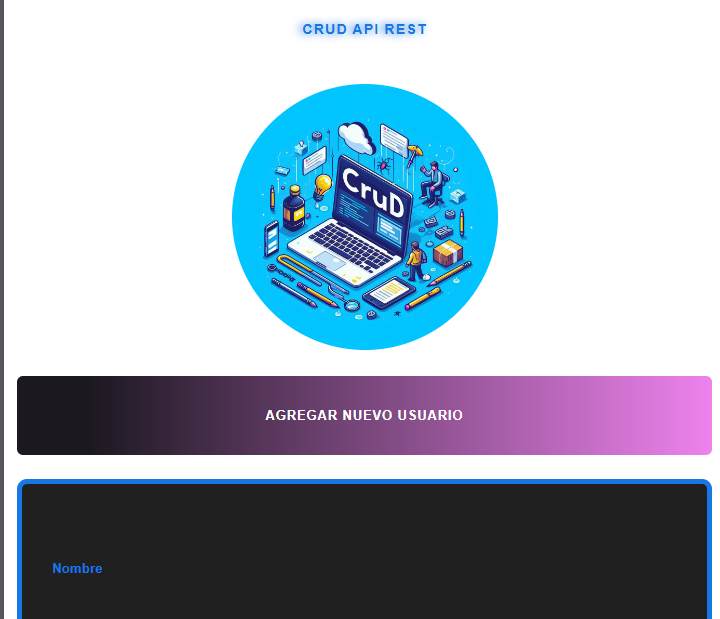

# Mi Proyecto

Este es un proyecto de práctica de CRUD con peticiones AJAX especialemente utilizando la API.

## Configuración del servidor

Para probar este proyecto localmente, necesitarás instalar json-server y crear un archivo `db.json`.

### Paso 1: Instalar json-server

Puedes instalar json-server globalmente en tu máquina utilizando npm (Node Package Manager) con el siguiente comando:

npm install -g json-server

### Paso 2: Crear un archivo db.json

Crea un archivo `db.json` en la raíz de tu proyecto. Este archivo actuará como una base de datos falsa para tu servidor. Puedes llenarlo con algunos datos iniciales para empezar.

### Paso 3: Iniciar el servidor

Para iniciar el servidor, navega hasta la carpeta de tu proyecto en la línea de comandos y ejecuta el siguiente comando:

json-server --watch db.json

Esto iniciará el servidor y cualquier cambio que hagas en `db.json` se reflejará en tiempo real.

Para más detalles, puedes consultar la documentación oficial de json-server.
